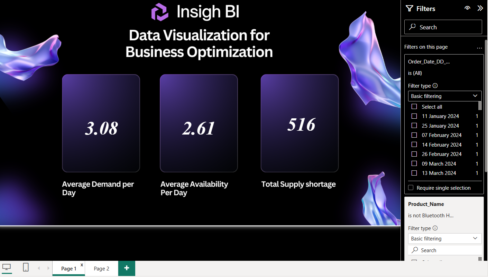
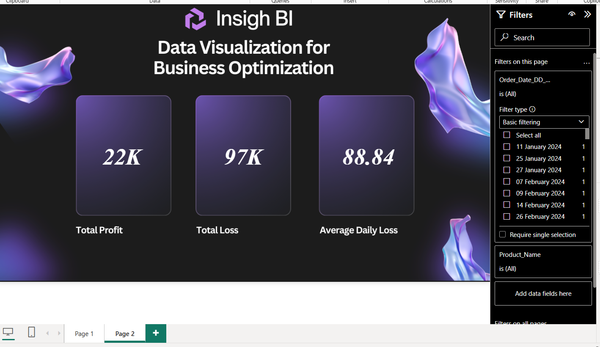
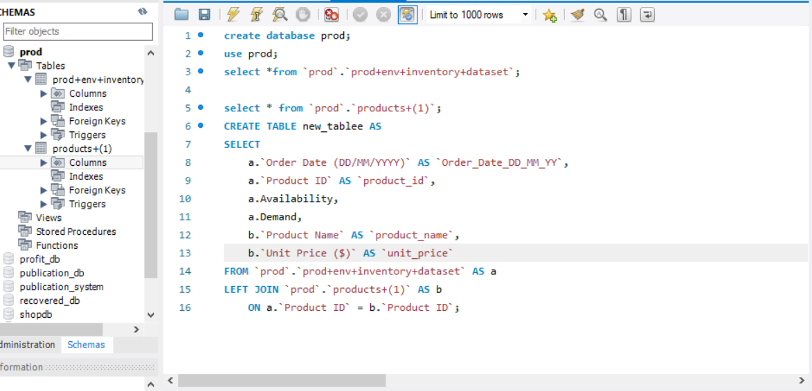

# 📊 Inventory Analytics & Business Optimization Dashboard

## 📌 Project Overview

This project is an **end-to-end Business Intelligence and Data Analytics solution** developed using **Power BI, SQL Server, MySQL, and DAX**.

The objective of the project is to analyze inventory-related data and create an interactive Power BI dashboard that helps understand important business metrics such as **profit, loss, demand, availability, and supply shortages**.

The project covers the complete analytics workflow — from **database preparation and SQL queries to data transformation, DAX calculations, visualization, and dashboard development**.

---

## 🎯 Project Objectives

- Analyze inventory and product-related data
- Prepare and clean raw data using SQL
- Combine inventory and product information using SQL joins
- Calculate important business KPIs
- Analyze demand and product availability
- Identify supply shortages
- Create interactive Power BI dashboards
- Connect Power BI with SQL-based data sources
- Understand the workflow from test environment to production environment

---

## 🛠️ Tools & Technologies

| Technology | Purpose |
|---|---|
| **Power BI** | Data visualization and dashboard development |
| **SQL Server** | Data preparation, querying and transformation |
| **MySQL** | Database management and SQL implementation |
| **SQL** | Data extraction, cleaning and joining |
| **DAX** | Measures and KPI calculations |
| **Power BI Data Modeling** | Organizing data for reporting |

---

## 🔄 Project Workflow

```text
Raw Data
   ↓
SQL Server
   ↓
Data Cleaning & Preparation
   ↓
SQL Queries & LEFT JOIN
   ↓
MySQL Database
   ↓
Power BI
   ↓
DAX Measures & KPIs
   ↓
Interactive Dashboard
   ↓
Business Insights
```

---

## 🗄️ Database & SQL Work

The project uses both **SQL Server and MySQL** for database operations.

### SQL Server

The SQL Server environment was used for:

- Creating databases
- Importing data
- Exploring datasets
- Checking distinct values
- Cleaning data
- Joining inventory and product tables
- Preparing reporting tables
- Working with test and production environments

A `LEFT JOIN` was used to combine inventory information with product information using the **Product ID**.

Example:

```sql
SELECT
    a.[Order_Date_DD_MM_YYYY],
    a.[Product_ID],
    a.[Availability],
    b.[Product_Name],
    b.[Unit_Price]
FROM [Test+Environment+Inventory+Dataset] AS a
LEFT JOIN Products AS b
    ON a.Product_ID = b.Product_ID;
```

### MySQL

The equivalent SQL logic was implemented in **MySQL Workbench**.

The MySQL environment was used to:

- Create databases and tables
- Import data
- Query inventory data
- Join product and inventory tables
- Prepare data for reporting

---

## 📊 Power BI Dashboard

The final Power BI report contains multiple KPI-based dashboard pages.

### Page 1 — Profit & Loss Analysis

The first dashboard focuses on financial and loss-related metrics.

### Key KPIs

- **Total Profit**
- **Total Loss**
- **Average Daily Loss**

### Page 2 — Inventory & Supply Analysis

The second dashboard focuses on inventory performance and supply.

### Key KPIs

- **Average Demand per Day**
- **Average Availability per Day**
- **Total Supply Shortage**

The dashboard also includes filters that allow users to analyze the data based on different dates and products.

---

## 📈 Key Metrics

The project includes the following major business metrics:

### 💰 Total Profit
Measures the overall profit generated from the available data.

### 📉 Total Loss
Measures the total loss recorded in the dataset.

### 📅 Average Daily Loss
Shows the average loss per day.

### 📦 Average Demand per Day
Measures the average product demand on a daily basis.

### 🏪 Average Availability per Day
Shows the average availability of products.

### ⚠️ Total Supply Shortage
Highlights the total shortage between demand and available supply.

---

## 🧮 DAX & KPI Development

DAX was used in Power BI to create calculated measures and KPIs required for the dashboards.

The measures help transform raw database information into meaningful business metrics that can be visualized and analyzed interactively.

---

## 🔗 Data Integration

The project demonstrates integration between:

```text
SQL Server
     ↓
Data Preparation
     ↓
MySQL
     ↓
Power BI
```

This helped me understand how data moves through different stages of a real-world analytics workflow.

---

## 🖥️ Dashboard Screenshots

### Dashboard — Page 1



### Dashboard — Page 2



### SQL Server


### MySQL Workbench



---

## 📁 Project Structure

```text
PowerBI-Inventory-Analytics/
│
├── README.md
│
├── PowerBI/
│   └── Inventory_Analytics.pbix
│
├── SQL_Server/
│   └── inventory_queries.sql
│
├── MySQL/
│   └── inventory_mysql_queries.sql
│
├── Screenshots/
│   ├── dashboard_page1.png
│   ├── dashboard_page2.png
│   ├── sql_server.png
│   └── mysql.png
│
└── Documentation/
    └── project_overview.pdf
```

---

## 🎓 Key Learning Outcomes

Through this project, I strengthened my practical understanding of:

- Power BI dashboard development
- SQL Server
- MySQL
- SQL queries
- `LEFT JOIN`
- Data cleaning and preparation
- Data transformation
- DAX measures
- KPI development
- Data visualization
- Business Intelligence
- Database-to-dashboard workflow
- Test and production environments

---

## 🚀 Future Improvements

Some possible improvements for future versions of the project include:

- Adding more interactive visualizations
- Creating additional business KPIs
- Adding trend analysis
- Improving data modeling
- Adding automated data refresh
- Deploying the dashboard to Power BI Service
- Adding more advanced DAX calculations

---

## 👩‍💻 Author

**Nita Joshi**

Aspiring **Data Analyst | Data Scientist | Data Engineer**

Currently developing skills in:

**Power BI • SQL • MySQL • SQL Server • DAX • Data Analytics • Data Visualization**

---

## ⭐ Acknowledgement

This project was completed as part of my hands-on learning journey in **Power BI, SQL, MySQL, and Business Intelligence**.

The project helped me gain practical exposure to the complete process of transforming raw data into meaningful business insights.

---

